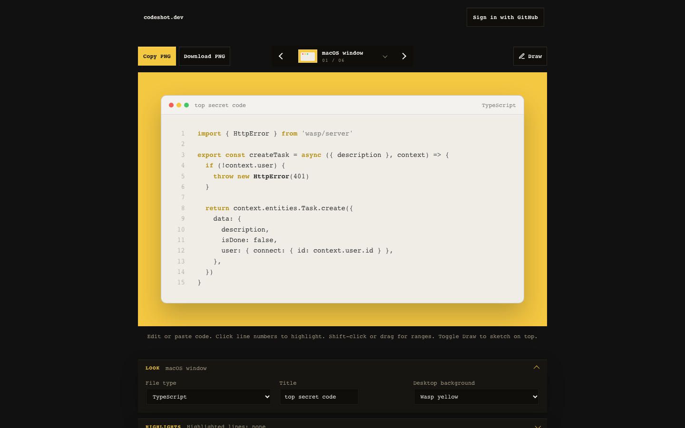

# codeshot.dev



Minimal code screenshot generator.

```bash
npm install --global @wasp.sh/wasp-cli@0.24.0
wasp install
npm run dev
npm run build
npm run preview
```

## Deployment

Provision the Railway project once, then use the regular deploy command for updates:

```bash
wasp deploy railway launch code-screenshot
npm run deploy
```

GitHub Actions requires `RAILWAY_API_TOKEN` and `RAILWAY_PROJECT_ID` repository secrets.
