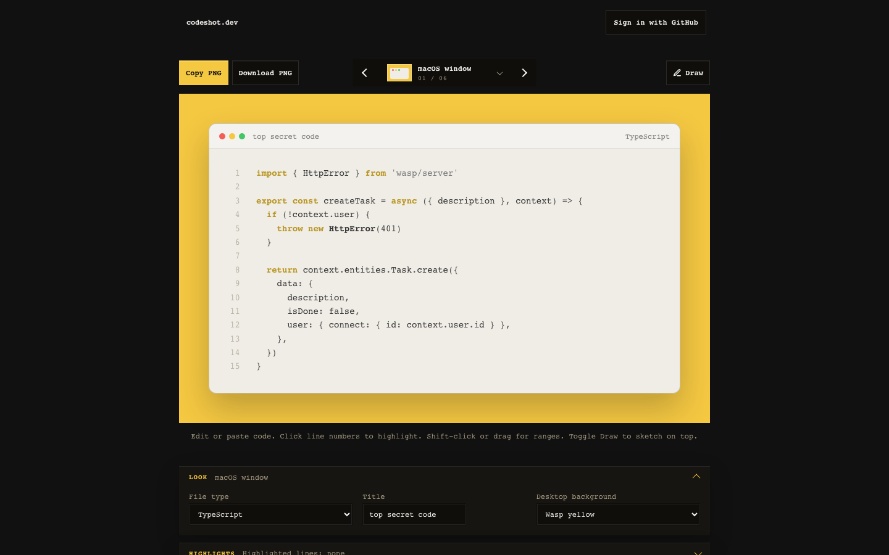

# codeshot.dev



Minimal code screenshot generator.

```bash
npx codeshot.dev render src/app.tsx --theme macos --output screenshot.png
```

Use a published shared theme by URL or reference. Add `@VERSION` to pin its output:

```bash
npx codeshot.dev render src/app.tsx --theme https://codeshot.dev/a/SHARE_ID --output screenshot.png
npx codeshot.dev render src/app.tsx --theme share:SHARE_ID@2 --output screenshot.png
```

See [`cli/README.md`](cli/README.md) for theme discovery, stdin, highlights, and other options.

```bash
npm install --global @wasp.sh/wasp-cli@0.25.0
cd app
wasp install
cd ..
npm run dev
npm run build
npm run preview
```

The Playwright renderer is built separately from `screenshot-service/Dockerfile`.

## Deployment

Provision the Railway project once:

```bash
cd app
wasp deploy railway launch code-screenshot
```

After launch, push `main` to deploy Wasp updates through `.github/workflows/deploy.yml` and renderer updates through `.github/workflows/deploy-renderer.yml`. Do not deploy updates locally.

GitHub Actions requires `RAILWAY_API_TOKEN` and `RAILWAY_PROJECT_ID` repository secrets.

The renderer service must already exist as `code-screenshot-renderer`. It stays private, deploys from `screenshot-service/Dockerfile`, and requires `SCREENSHOT_SERVICE_TOKEN`, `CAPTURE_ORIGIN=https://codeshot.dev`, `CAPTURE_CONCURRENCY=1`, and `CAPTURE_TIMEOUT_MS=15000`.

## Anonymous themes

Visitors create and edit a theme without an account; signing in is required only to save. Unclaimed
themes are swept hourly by the `collectAbandonedGuestWork` job.

The server rate limits only the writes an anonymous browser can reach. The coarse per-IP limit is a
Cloudflare rate limiting rule on `POST /operations/*` (one rule is included on the free plan).

## Analytics

Plausible requires the variables in `app/.env.server.example` and custom event goals matching these names exactly:

```text
Screenshot Copied
Screenshot Downloaded
Ambient Created
Ambient Version Saved
Ambient Sharing Enabled
Share Link Copied
Shared Ambient Viewed
Agent Prompt Copied
```
